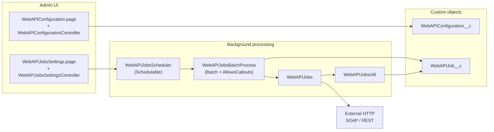
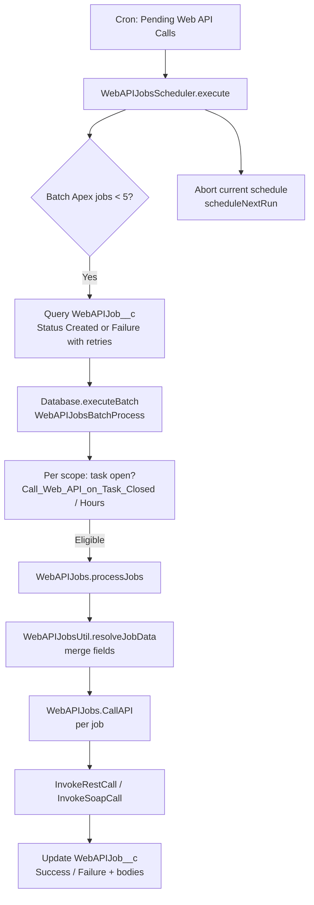
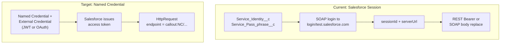
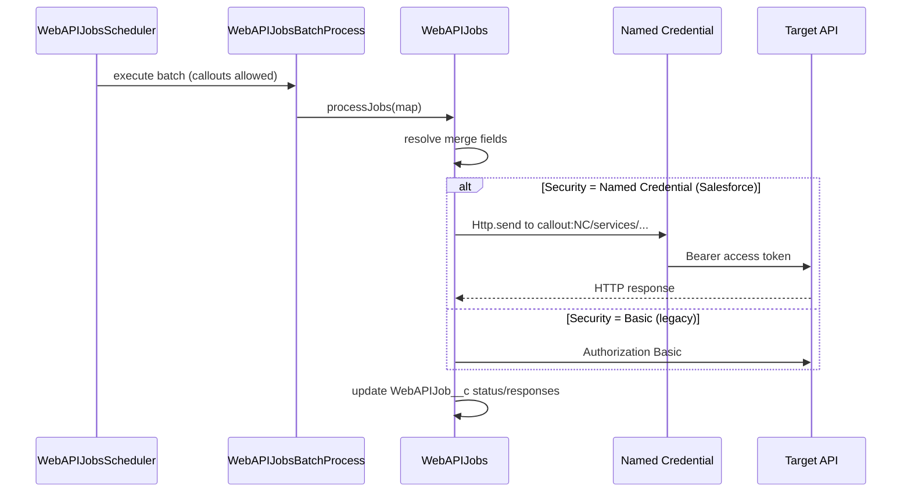
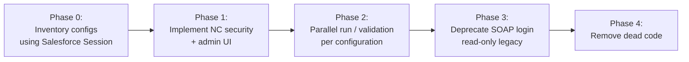

# Software Design Document: Web API Configuration — Authentication Migration

**Document type:** Design / migration analysis (code review only; no implementation in this deliverable)  
**Audience:** Senior Salesforce developers, architects, product owners  
**Related product documentation:** [Configuring external web APIs to automate processes in Remedyforce](https://docs.helixops.ai/bin/More-Products/RemedyForce/BMC-Helix-Remedyforce/remforce202502/Integrating/Configuring-external-web-APIs-to-automate-processes-in-BMC-Remedyforce/)  
**Repository note:** `WebAPIConfiguration__c` and `WebAPIJob__c` object metadata are not present in this workspace (likely managed or external package). Field inventory below is inferred from Apex and Visualforce references.

---

## 1. Executive summary

The **Web API Configuration** feature lets administrators define outbound HTTP integrations (REST and SOAP) that run **asynchronously** when related **Web API Jobs** are processed by a **scheduler-driven batch**. Authentication today relies on **HTTP Basic** (username + password) and, for Salesforce targets, a **SOAP `login` call** to obtain a **session ID**, which is then injected into SOAP bodies (`##SESSIONID##`) or REST headers (`Authorization: Bearer <sessionId>`).

Salesforce is retiring **username/password–based SOAP login** for API access in favor of modern OAuth flows (for example **OAuth 2.0 JWT bearer** and **Named Credentials**). This document describes the **current behavior**, **migration drivers**, and a **target design** aligned with patterns already used in this codebase for **Configuration Set** and **Smart Sync** (Named Credential + REST callouts).

---

## 2. Business and product context

Per Remedyforce documentation, Web API configurations support:

- **Service types:** REST, SOAP Basic (WSDL-driven parameters), SOAP Advanced (custom envelope).
- **Security types:** None, Basic Authentication, **Salesforce Session** (for calling Salesforce APIs).
- **Automation:** Task templates, request definitions, Task field, custom automation; jobs are **queued** and executed on a **schedule** (default 15 minutes, configurable floor 5 minutes).
- **Operational controls:** Retry count (custom setting), scheduler start/stop, optional **call after task close** within a time window.

The implementation must continue to support **background execution** (no interactive user session), **merge fields** from Task and related records, and **clear success/failure** capture on `WebAPIJob__c`.

---

## 3. Current architecture (as implemented in code)

### 3.1 High-level component map

### 3.2 End-to-end job execution flow

### 3.3 Class responsibilities

| Artifact | Responsibility |
|----------|----------------|
| `WebAPIConfigurationController` | CRUD UI for `WebAPIConfiguration__c`; builds picklists from schema; encrypts or base64-encodes `Service_Pass_phrase__c` on save; masks password on load; orchestrates SOAP Basic WSDL load via `WebAPIJobsUtil.loadMethods`. |
| `WebAPIConfiguration.page` | ExtJS-based admin UI; references `Security_Type__c`, `Service_Identity__c`, password field, certificates, service URL, etc. |
| `WebAPIJobsSettingsController` | Persists retry count (`BMCSYSProperties__c` `WebAPIJobRetryCount`); starts/stops scheduled job `Pending Web API Calls`; reads interval from `RemedyforceSettings__c` `WebAPISchedulerInterval`. |
| `WebAPIJobsScheduler` | Schedulable entry point; throttles batch concurrency; builds dynamic SOQL for pending jobs; chains next schedule. |
| `WebAPIJobsBatchProcess` | Applies **task state / close window** gating; delegates eligible jobs to `WebAPIJobs`. |
| `WebAPIJobs` | Loads `WebAPIConfiguration__c` for each job; resolves merge fields (via util); performs **callouts**; updates job status. |
| `WebAPIJobsUtil` | Merge-field resolution (`{{...}}`); SOAP WSDL fetch and parse for SOAP Basic (`loadMethods` / `loadParameters`); uses **Basic auth** for WSDL GET when configuration security is Basic. |
| `WebAPIJob` | Simple DTO pairing `WebAPIJob__c` + `WebAPIConfiguration__c`. |

---

## 4. Current authentication behavior (detailed)

### 4.1 Credential storage model

- **`Service_Identity__c`:** Username (Basic) or Salesforce username (Salesforce session type).
- **`Service_Pass_phrase__c`:** Password or secret; stored either as **SkyWalker-encrypted** value (when `BMCSYSproperties__c` `RemedyforceAPI_WebApi` has a GUID) or **base64-encoded** plaintext.
- **`Is_Sandbox__c`:** For Salesforce session, selects `test` vs `login` host for the **SOAP login** endpoint.

### 4.2 `WebAPIJobs.CallAPI` and `Security_Type__c`

When `Security_Type__c` is populated:

- **`Basic`:** Builds `Authorization: Basic <base64(user:password)>` after decoding `Service_Pass_phrase__c`.
- **Non-Salesforce:** Optionally applies **mutual TLS** via `setClientCertificateName` when `Required_Certificate__c` is true (except when security type is Salesforce — certificate branch is skipped for Salesforce type in the shown logic).
- **REST vs SOAP:** Dispatches to `InvokeRestCall` or `InvokeSoapCall`.

**Salesforce session (`Security_Type__c == "Salesforce"`):**

1. **`getWebAPISessionInfo(username, password, isSandbox)`** sends a **POST** to  
   `https://{login|test}.salesforce.com/services/Soap/c/31.0`  
   with a **SOAP envelope** containing `<login><username>…</username><password>…</password></login>`.
2. Parses XML response for **`serverUrl`**, **`sessionId`**, **`organizationId`**, **`metadataServerUrl`**.
3. **SOAP path:** Replaces `##SESSIONID##` in body; sets endpoint to **`serverUrl`** from login (not the user-configured `Service_URL__c` for the main call in this branch).
4. **REST path:** Sets `Authorization: Bearer <sessionId>`; uses user-configured **`Service_URL__c`** as endpoint.

### 4.3 `WebAPIJobsUtil.loadMethods` (SOAP Basic WSDL)

- Performs **GET** to `WebAPIConfiguration.Service_URL__c` (WSDL).
- If `Security_Type__c` is **Basic**, attaches Basic auth using `Service_Identity__c` + decoded `Service_Pass_phrase__c`.

### 4.4 Admin UI (`WebAPIConfigurationController`)

- On load, decrypts/decode password into transient `Password` property and replaces stored value display with **`********`**.
- On save, if password unchanged (`********`), retains existing stored passphrase; otherwise re-encrypts or base64-encodes.

### 4.5 Reference: modern pattern already in this org

**Smart Sync / Configuration Set** validate connectivity using a **Named Credential** and **REST** (`CALLOUT:<DeveloperName>/services/data/...`) in `SmartSyncController` / `ConfigurationSet`, avoiding stored interactive passwords and SOAP login.

---

## 5. Problem statement and migration drivers

| Issue | Impact |
|-------|--------|
| **SOAP `login` retirement / restriction** | `getWebAPISessionInfo` depends on **enterprise SOAP login**. This is the primary breakage risk for **Salesforce Session** security type. |
| **Long-lived session IDs from password login** | Even before hard retirement, password-based session acquisition is **discouraged** for integrations; token-based flows are preferred. |
| **Secrets in custom fields** | `Service_Pass_phrase__c` on a custom object increases **rotation**, **audit**, and **least-privilege** burden compared to **Named Credentials / External Credentials**. |
| **Background execution** | Replacement must work in **batch/schedulable** context **without** user interaction — Named Credentials and JWT bearer are suitable. |
| **Multi-tenant / packaged metadata** | Object definitions may live in a **managed package**; field additions or new picklist values may require **package upgrade** strategy (operational constraint to confirm with packaging model). |

**Scope clarification:**

- **Salesforce-as-target** configurations using **Salesforce Session** are in scope for **mandatory** redesign.
- **Basic** auth to **non-Salesforce** endpoints may remain valid longer but would still benefit from **External Credential** patterns where policies require it.

---

## 6. Target authentication model (recommended)

### 6.1 Guiding principles

1. **Do not implement Salesforce session acquisition via SOAP `login` or username/password OAuth ROPC** for new or migrated integrations.
2. **Prefer Named Credentials** (with **External Credentials** where needed) so Salesforce manages token exchange, signing, and storage boundaries.
3. **Align with Smart Sync / Configuration Set**: administrator selects a **Named Credential** (developer name), Apex uses **`CALLOUT:`** prefix for callouts.
4. **Preserve** merge-field behavior, scheduler semantics, retry logging, and SOAP/REST branching.

### 6.2 Proposed security type evolution

| Current value | Target |
|---------------|--------|
| None | Unchanged (no auth headers beyond what user puts in body/headers). |
| Basic | **Phase 1:** Keep for backward compatibility with non-Salesforce APIs. **Phase 2 (optional):** migrate to **External Credential** + Named Credential for HTTP Basic to centralize secrets. |
| Salesforce | **Replace** with something like **“Salesforce (Named Credential)”** — no password field; optional **OAuth-friendly** session handling only if still required (ideally avoid custom session entirely). |

**Implementation approaches for “Salesforce (Named Credential)”:**

- **Option A (preferred):** Store **`Named_Credential_DeveloperName__c`** (or reuse a generic “Outbound Auth” field). At runtime, set  
  `request.setEndpoint('callout:' + developerName + pathSuffix)`  
  where `pathSuffix` is derived from configured `Service_URL__c` **or** administrators enter a **path-only** field to avoid duplicating host (design choice — see §8).
- **Option B:** If the integration must continue using a **full URL** field for non-Salesforce targets, for Salesforce Named Credential targets enforce **URL mapping rules** (same org as NC) to prevent endpoint bypass.

For **REST**, Named Credential typically injects **`Authorization`**. Custom headers from `HTTPHeaders__c` must be **merged** without breaking NC headers (test for override behavior).

For **SOAP Advanced** with `##SESSIONID##`, two sub-options:

1. **Eliminate placeholder:** Use NC callout to Partner SOAP / REST equivalent so session is implicit (may require template changes).
2. **If a session string is still required in XML:** Use a **short-lived token** via supported OAuth flow (discouraged to hand-roll); better to **refactor templates** to use REST or to use headers NC provides.

### 6.3 Logical comparison (current vs target)

---

## 7. Detailed runtime sequence (target state)

---

## 8. Design decisions to resolve before implementation

1. **Endpoint composition:** Should `Service_URL__c` remain a **full absolute URL** for all types, or should Named Credential flows use **relative paths** only (recommended to avoid host mismatch)?
2. **SOAP Advanced + Salesforce:** Is **`##SESSIONID##`** still a supported contract for customers, or can migration require **template updates** to NC-based REST/SOAP without embedded session?
3. **WSDL load (`loadMethods`):** For Salesforce-hosted WSDL over NC, does **GET** WSDL require a **separate NC** or same NC with different path? (Same NC is typical.)
4. **Certificates:** Map `Required_Certificate__c` / `Certificate_Name__c` to **Named Credential certificate settings** or keep parallel model; avoid duplicate client cert application.
5. **Packaging:** Confirm whether new fields / picklist values ship in **managed package** and whether **Feature Management** or **post-install scripts** are needed to set org defaults.
6. **Migration tooling:** Automated conversion from stored username/password to NC is **not** generally possible without admin action; provide **runbook** and **in-app validation** (“Test connection”) similar to `SmartSyncController.sfLogin` / `ConfigurationSet.sfLogin`.

---

## 9. Data model (conceptual)

> Exact API names must follow org naming conventions and package prefixes.

| Conceptual field | Purpose |
|------------------|---------|
| `Security_Type__c` | Extended with new value, e.g. `NamedCredential`, or `SalesforceNC` while deprecating `Salesforce`. |
| `Named_Credential__c` (Text) | DeveloperName of Named Credential used for callout root. |
| (Optional) `Callout_Base_Path__c` | Path prefix for REST/SOAP when using NC (if `Service_URL__c` is retired for this mode). |
| `Service_Identity__c` / `Service_Pass_phrase__c` | **Hidden or cleared** when NC security is selected; validation prevents saving secrets in wrong mode. |

**Validation rules (conceptual):**

- If security = legacy Salesforce → show **migration banner** / block save on new records (policy decision).
- If security = NC → require `Named_Credential__c`; verify Named Credential exists (query `NamedCredential` as in `SmartSyncController.namedCredentialExists`).

---

## 10. Apex touchpoints for implementation (future work)

| Area | File | Change class (conceptual) |
|------|------|-----------------------------|
| Session acquisition | `WebAPIJobs.getWebAPISessionInfo` | Remove or gate behind legacy; replace with NC-based requests or delete path. |
| REST callout | `WebAPIJobs.InvokeRestCall` | Branch: NC → `setEndpoint('callout:' + …)`; omit manual Bearer from SOAP login. |
| SOAP callout | `WebAPIJobs.InvokeSoapCall` | Same; reconcile `serverUrl` vs configured URL behavior with documented rules. |
| Entry | `WebAPIJobs.CallAPI` | Extend security branching; ensure governor-friendly token usage (NC handles caching/refresh per platform rules). |
| WSDL | `WebAPIJobsUtil.loadMethods` | Support NC for GET WSDL when Basic/Salesforce password is retired. |
| UI + save | `WebAPIConfigurationController` | Bind new fields; validation; optional test method. |
| Tests | `WebAPIJobsTest`, `WebAPIConfigurationControllerTest`, etc. | HttpCalloutMock for `callout:` endpoints; multi-security-type coverage. |

---

## 11. Non-functional requirements

- **Security:** No long-term storage of integration user passwords for Salesforce; secrets in NC/External Credential vault.
- **Reliability:** Scheduler + batch behavior unchanged; failed NC auth should populate `FailedResponse__c` with **sanitized** messages (avoid leaking tokens).
- **Performance:** JWT / OAuth via NC should not materially exceed one SOAP login + API call; batch scope (`scopeSize = 2`) and HTTP timeouts (`InvokeRestCall` `timeoutInterval = 20000`) should be revisited under load tests.
- **Compliance:** Admin-only configuration; align with `with sharing` on controllers (already present on configuration controllers).

---

## 12. Migration and rollout strategy (phased)

1. **Inventory:** Report all `WebAPIConfiguration__c` where `Security_Type__c = 'Salesforce'` (and any Basic hitting Salesforce login URLs).
2. **Provision NC:** Per target org, create **External Credential** + **Named Credential** (JWT bearer or appropriate flow); document required **Connected App** / **certificate** steps (reuse internal runbook used for Smart Sync where applicable).
3. **Recreate or edit configurations:** Point to NC; re-test **REST** and **SOAP Advanced** templates.
4. **Cutover:** Disable legacy security picklist for new records; set sunset date for edits to legacy records.
5. **Decommission:** Remove `getWebAPISessionInfo` SOAP login once telemetry shows zero use.

---

## 13. Testing strategy (outline)

- **Unit:** HttpCalloutMock for `callout:NamedCred/services/data/v60.0/query/...` success and OAuth error bodies.
- **Integration:** Scheduler + batch with **queueable test context** limitations observed; use `Test.setMock` and small batch scope.
- **Regression:** Basic auth to mock non-Salesforce server; SOAP Basic WSDL parse; merge fields in URL/body/headers.
- **UAT:** Real Named Credential against sandbox partner org; verify **task close** window and retries.

---

## 14. Risks and mitigations

| Risk | Mitigation |
|------|------------|
| Customers rely on **`##SESSIONID##`** in SOAP | Communication + migration guide; offer REST-first examples from Helix docs patterns. |
| **Full URL** in `Service_URL__c` conflicts with NC host | Enforce relative path mode or validate URL host against NC endpoint. |
| **Managed package** cannot add fields quickly | Interim **Custom Metadata** mapping table (org-local) — only if packaging blocks object fields (architectural fallback). |
| **Named Credential** misconfiguration in production | In-ui “Test” action and clear error mapping like `SmartSyncController.buildLoginErrorMessage` patterns. |

---

## 15. Appendix: fields referenced in code (inferred)

**`WebAPIConfiguration__c` (from queries and logic):**  
`Id`, `Name`, `Call_Web_API_on_Task_Closed__c`, `Certificate_Name__c`, `Hours__c`, `HTTPBody__c`, `HTTPHeaders__c`, `HttpMethod__c`, `HTTP_Content_Type__c`, `Is_Sandbox__c`, `Required_Certificate__c`, `Security_Type__c`, `Service_Identity__c`, `Service_Pass_phrase__c`, `Service_Type__c`, `Service_URL__c`, `inactive__c`, `SOAP_Method_Name__c`, `Request_Target_Namespace__c`

**`WebAPIJob__c` (from batch query and updates):**  
`Id`, `Status__c`, `FailedResponse__c`, `RetryCount__c`, `SuccessResponse__c`, `Task__c`, `WebAPIConfiguration__c`, plus related `Task__r` fields used for gating (`State__c`, `Status_ID__c`, `closeDateTime__c`) and configuration flags (`Call_Web_API_on_Task_Closed__c`, `Hours__c`).

**Supporting custom settings / properties:**  
`BMCSYSproperties__c` `RemedyforceAPI_WebApi`, `BMCSYSProperties__c` `WebAPIJobRetryCount`, `RemedyforceSettings__c` `WebAPISchedulerInterval`.

---

## 16. Summary

The Web API feature’s **Salesforce Session** path is **tightly coupled** to **SOAP username/password login** in `WebAPIJobs.getWebAPISessionInfo`, which is the **primary technical debt** driving this migration. The **recommended direction** is to introduce a **Named Credential–based security mode**, consistent with **Smart Sync / Configuration Set**, and to **phase out** SOAP login–based session acquisition while preserving the **scheduler → batch → merge fields → callout → job update** pipeline illustrated above.

---

*End of document.*
